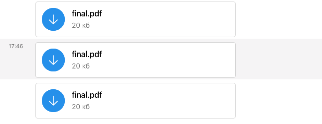

# Messaging

## Subscribing on updates

In all of SDK's there is only way to receive messages (and any other updates): subscribing on messages via ``onMessage`` method:

<!-- tabs:start -->

#### ** Python **

```python
bot = DialogBot.get_insecure_bot(
    ...
)

bot.messaging.on_message(on_msg) # subscribing on incoming messages with callback
```

``on_msg`` is a callback that accepts the ``params`` tuple with message updates. Fields of ``params`` object are:

* **peer** - Peer object of message sender
* **sender_uid** - sender's id
* **date** - message timestamp
* **message** - MessageContent object
* **mid** - message id


#### ** Java **

```java
Bot bot = Bot.start("cbb4994cabfa8d2a5bce0b5f7a44c23da943f767").get();

bot.messaging().onMessage(message -> // subscribing on incoming messages with callback
            ...
)
```

#### ** JavaScript **

```javascript
bot.updateSubject.subscribe({ // subscribing on updates
  next(update) {
    console.log('update', update);
  }
});

bot
  .onMessage(async (message) => { // providing a callback
    ...
 })
```

<!-- tabs:end -->


## Sending messages

There are high-level functions for sending messages:

<!-- tabs:start -->

#### ** Python **

```python
bot.messaging.send_message(peer, message)
```

#### ** Java **

```java
bot.messaging().sendText(peer, message);
```

#### ** JavaScript **

```javascript
bot.sendText(peer, text)
```

<!-- tabs:end -->

## Sending files

For sending files:

<!-- tabs:start -->

#### ** Python **

```python
bot.messaging.send_file(peer, path_to_file)
```

#### ** Java **

```java
bot.messaging().onMessage(message ->
         ...
        ).thenCompose(aVoid ->
                bot.messaging().sendFile(message.getPeer(), new File(path_to_file))
        )
...
```

#### ** JavaScript **

```javascript
bot.sendDocument(message.peer, filename)
```

<!-- tabs:end -->

Result:

?> 

## Sending images with preview

You also can send images to chat with auto-generated preview (not like files):

<!-- tabs:start -->

#### ** Python **

```python
bot.messaging.send_image(peer, path_to_image)
```

#### ** Java **

```java
bot.messaging().onMessage(message ->
         ...
        ).thenCompose(aVoid ->
                bot.messaging().sendFile(message.getPeer(), new File(path_to_file))
        )
...
```

#### ** JavaScript **

```javascript
bot.sendImage(message.peer, path_to_image)
```

<!-- tabs:end -->

Result:

?> 

## Handling interactive elements

It's possible to send different controls (buttons, comboboxes) directly to the chat, for example:

<!-- tabs:start -->

#### ** Python **

For Python SDK, it's needed to add extra callback for handling actions:

```python
from dialog_bot_sdk import interactive_media


def on_msg(*params):
    print('on msg', params)
    bot.messaging.send_message(
        params[0].peer,
        "buttons",
        [interactive_media.InteractiveMediaGroup(
            [
                interactive_media.InteractiveMedia(
                    1,
                    interactive_media.InteractiveMediaButton("Test", "button_one")
                ),
                interactive_media.InteractiveMedia(
                    1,
                    interactive_media.InteractiveMediaButton("Test", "button_two")
                ),
            ]
        )]
    )

def on_click(*params):
    print('on click', params)


bot.messaging.on_message(on_msg, on_click)

```

``on_click`` is a callback that accepts the ``params`` tuple with interactive media updates. Fields of ``params`` object are:

* **uid** - id of user who performed interaction
* **value** - element value
* **id** - element local id (within message)
* **mid** - message id where interaction was performed


#### ** Java **

```java
List<InteractiveAction> actions = new ArrayList<>();

actions.add(new InteractiveAction("button_one", new InteractiveButton("button_one", "button_one")));
actions.add(new InteractiveAction("button_two", new InteractiveButton("button_two", "button_two")));

InteractiveGroup group = new InteractiveGroup(actions);

return bot.interactiveApi().send(peer, group);
```

#### ** JavaScript **

```javascript
bot
  .onMessage(async (message) => {
    await bot.sendText(
        message.peer,
        message.content.text,
        MessageAttachment.reply(message.id),
        ActionGroup.create({
          actions: [
            Action.create({
              id: 'test',
              widget: Button.create({ label: 'button_one' })
          }),
          Action.create({
            id: 'test',
            widget: Button.create({ label: 'button_two' })
          })
          ]
        })
      );
  }
)
```

<!-- tabs:end -->

Result:

?> 
