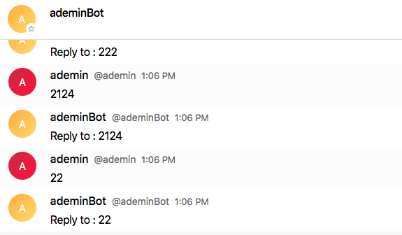

# Usage

## Test endpoint

For test purposes you can use our test environment with a credentials above:

||
| -------------------------------------- | -----------------------------------|
| **Web URL**                            | https://grps-test.transmit.im      |
| **Endpoint for browser/desktop app**   | https://grps-test.transmit.im:8443 |
| **Endpoint for bot (insecure)**        | grps-test.transmit.im:8080         |
| **Login**                              | testuser                           |
| **Password**                           | testpassword                       |

?> 

Web URL is needed to access messenger via browser. Endpoints for browser or desktop app and
for bot used for connect to Dialog GUI and Dialog API correspondingly. Insecure means establishing
connection to test endpoint without SSL.  

## Obtaining a token

Dialog bots use token-based authorization. For obtaining a token,
you have to go to Dialog URL (for example ``https://grps-test.transmit.im``),
type ``Security Bot`` in search bar of your Dialog and start conversation with them.
To create new bot just send him this command:
```
/bot new <bot_nickname> <bot_name>
```
?> Notice that `nickname` is unique system name while `name` is displayed in dialog
list and can be non-unique.

## Simple echobot example
Endpoint address and token are all you need to set up your bot. So the full example of simple echobot looks like this:

<!-- tabs:start -->

#### ** Python **

```python
from dialog_bot_sdk.bot import DialogBot


def on_msg(*params):
    print('on msg', params)
    bot.messaging.send_message(
        params[0].peer, 'Reply to : ' + str(params[0].message.textMessage.text)
    )


if __name__ == '__main__':
    bot = DialogBot.get_insecure_bot(
        'grpc-test.transmit.im:8080',  # bot endpoint
        'cbb4994cabfa8d2a5bce0b5f7a44c23da943f767'  # bot token
    )

    bot.messaging.on_message(on_msg)

```

#### ** Java **

```java
import java.util.concurrent.ExecutionException;
import im.dlg.botsdk.Bot;
import im.dlg.botsdk.BotConfig;

public class Main {

    public static void main(String[] args) throws InterruptedException, ExecutionException {

        BotConfig botConfig = BotConfig.Builder.aBotConfig()
                .withHost("grpc-test.transmit.im")
                .withPort(8080)
                .withToken("e60137c00345e62ea8a21506cfe31b2be10852ec").build();

        bot.messaging().onMessage(message ->
                bot.users().get(message.getSender()).thenAccept(userOpt -> userOpt.ifPresent(user -> {
                            System.out.println("Got a message: " + message.getText() + " from user: " + user.getName());
                        })
                ).thenCompose(aVoid -> {
                            bot.messaging().sendText(message.getPeer(), "Reply to : " + message.getMessageContent().toString());
                            return null;
                        }
                ).thenAccept(uuid ->
                        System.out.println("Sent a message with UUID: " + uuid)));

        bot.await();
    }
}
```

#### ** JavaScript **

```javascript
import path from 'path';
import dotenv from 'dotenv';
import Bot, { MessageAttachment, ActionGroup, Action, Button } from '../src';

dotenv.config();

const token = process.env.BOT_TOKEN;
if (typeof token !== 'string') {
  throw new Error('BOT_TOKEN env variable not configured');
}

const bot = new Bot({
  token,
  endpoints: ['https://grpc-test.transmit.im:8443']
});

bot.updateSubject.subscribe({
  next(update) {
    console.log('update', update);
  }
});

bot
  .onMessage(async (message) => {
    if (message.content.type === 'text') {
      const mid = await bot.sendText(
        message.peer,
        message.content.text
      );
    }
  })
  .toPromise()
  .catch((error) => {
    console.error(error);
    process.exit(1);
  });

bot
  .onAction(async (event) => {
    console.log(event);
  })
  .toPromise()
  .catch((error) => {
    console.error(error);
    process.exit(1);
  });
```

<!-- tabs:end -->

Result of echobot's work:

?> 
